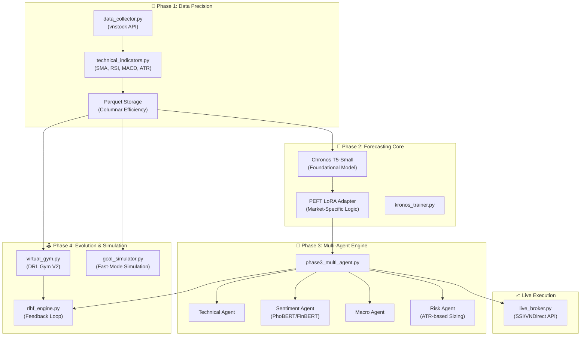

# 🚀 PentaAna: Multi-Agent Stock Intelligence & Autonomous Trading V2

**PentaAna** (formerly KRONOS) is a state-of-the-art AI ecosystem designed to dominate the Vietnamese stock market (VN-INDEX). It integrates **Generative AI forecasting**, **DRL-based strategy training**, and **Live Broker connectivity** into a single, cohesive MLOps-driven pipeline.

---

## 💎 Key Innovations in V2

### 1. Goal-Oriented Strategy Engine (`goal_simulator.py`)
Moving beyond simple signal generation, PentaAna V2 introduces **deterministic strategy backtesting**:
*   **Capital-Driven**: Start with a specific capital (e.g., 6M VND) and target an objective (e.g., 9M VND).
*   **Professional Lot Sizing**: Automatically calculates buy/sell quantities in **multiples of 100 shares** (Standard HOSE/HNX logic).
*   **Transaction Modeling**: Incorporates a 0.2% fee per trade and slippage estimation.
*   **Drawdown Guard**: Visualizes the **Maximum Drawdown** to assess the emotional and financial risk of the strategy.

### 2. DRL Virtual Gym V2 (`virtual_gym.py` & `drl_trainer.py`)
A "Time-Chamber" for AI to learn from the future/past without risking real money:
*   **Chaos Engine (Black Swan Simulation)**: Injects pandemic-style or crisis-style events.
*   **Causal Logic**: Sentiment shocks occur **before** price decay, forcing the AI to develop **preventative reflexes**.
*   **No-Leak Indicators**: Indicators (MACD, RSI, EMA) are recalculated **on-the-fly** within the gym when chaos strikes, ensuring the AI cannot "cheat" by looking at the original un-mutated indicators.
*   **Continuous Control**: Uses **Proximal Policy Optimization (PPO)** to learn a **Target Weight [0.0 - 1.0]**. Higher weights = aggressive stock exposure; Lower weights = flight to cash.

### 3. Self-Evolving MLOps & RLHF (`rlhf_engine.py`)
*   **RLHF**: Human feedback (ratings) is blended with market performance rewards to adapt agent weights (Technical, Sentiment, Macro, Risk) dynamically.
*   **Drift Detection**: Uses **PSI (Population Stability Index)** to monitor market distribution shifts. If PSI > 0.2, the system triggers an automatic LoRA fine-tuning queue.

---

## 🏗️ System Architecture



---

## 📊 Detailed Component breakdown

### 🧠 The Intelligence Core
*   **Forecasting**: Uses Amazon's **Chronos**, a T5-based language model trained on trillions of time-series points. We apply **Low-Rank Adaptation (LoRA)** to specialize it for VN-INDEX dynamics without losing its foundational capabilities.
*   **Sentiment**: Crawls Vietnamese news sources (using `news_crawler.py`) and processes them via **PhoBERT** (Vietnamese-specific) and **FinBERT** (Finance-specific) to generate a numeric `sentiment_score` (-1 to 1).

### 🕹️ The Strategy Simulation (Fast-Mode)
Located in `src/goal_simulator.py`. Unlike the AI-heavy multi-agent mode, Fast-Mode uses pre-defined technical policies (MACD crossovers, RSI thresholds) to simulate high-frequency trading over multiple years in seconds. This allows users to quickly validate if a "Goal" (e.g., 50% return) is theoretically achievable under current market conditions.

### 🏛️ The AI Gym (Training)
Located in `src/virtual_gym.py`. This is where the **Deep Reinforcement Learning** happens.
*   **State Space (9-dims)**: `[Price/EMA, MACD, RSI, Sentiment, Cash_Ratio, Share_Ratio, Profit_%, Price_Diff, Volatility]`.
*   **Action Space (Continuous)**: A value between `0` and `1` representing the percentage of NAV the bottle should invest in the asset.
*   **Reward Function**: `Reward = log(NAV_t / NAV_{t-1}) * Multiplier`.

---

## 🚀 Setup & Installation

### 1. Prerequisites
*   Python 3.10 or higher.
*   Node.js 18 or higher (for the dashboard).
*   **Apple Silicon (Optional but Recommended)**: The code is optimized for **MPS (Metal Performance Shaders)** to run LoRA fine-tuning natively on M1/M2/M3 chips.

### 2. Implementation
```bash
# Clone
git clone https://github.com/PentaYuki/PentaAna.git
cd PentaAna

# Virtual Environment
python3 -m venv .venv
source .venv/bin/activate

# Dependencies
pip install -r requirements.txt
pip install stable-baselines3 gymnasium pyarrow

# UI Setup
cd dashboard && npm install && cd ..
```

---

## 🛠️ Configuration Guide

### Live Broker Configuration (`.env`)
To enable paper or live trading, create a `.env` file based on `.env.example`:
```env
BROKER=paper                  # options: vndirect, ssi, paper
VNDIRECT_ACCOUNT=YourAcc
VNDIRECT_PRIVATE_KEY=YourKey
MAX_POSITION_VND=50000000     # Max 50M VND per trade
RISK_PER_TRADE_PCT=1.5        # Stop loss at 1.5% of account
```

---

## 📖 Operational Manual

### Running High-Accuracy Analysis
```bash
# Start Backend
uvicorn src.web_dashboard:app --host 0.0.0.0 --port 8088

# Start Background Processing (Crawl & Auto-Train)
python src/pipeline_manager.py
```

### Navigating the UI
1.  **Dashboard**: Overview of current signals and MLOps health.
2.  **Live Signals**: Trigger `live_broker.py` to evaluate the current market for a specific ticker.
3.  **Simulation**: Run the Fast-Mode backtest with your personal capital goals.
4.  **AI Gym**: Start the **DRL Training** loop to help the AI learn how to handle "Chaos" without risking your capital.

---

## 🧪 Math & Reward Logic

### Reward Sizing
In our RL environment, we use **Log Return** to ensure the agent learns multiplicative growth:
$$R_t = \ln\left(\frac{NAV_t}{NAV_{t-1}}\right) \times 10$$

### Chaos Scaling
When the **Chaos Engine** triggers a pandemic event, the sentiment is slashed:
$$S_{new} = \max(-0.95, S_{old} \times 0.3)$$
Price decay follows a lag of 1-3 bars to simulate market reaction time.

---

## 📁 Key File Descriptions
*   `src/virtual_gym.py`: The DRL training environment.
*   `src/drl_trainer.py`: Orchestrates the PPO learning loop.
*   `src/goal_simulator.py`: Handles high-speed strategic backtesting.
*   `src/live_broker.py`: Connects to real VNDirect/SSI APIs with Risk Management.
*   `src/rlhf_engine.py`: Manages the self-learning weight adaptation system.
*   `src/web_dashboard.py`: The core FastAPI backend.

---

## 📝 License & Contact
**MIT License.**
Developed by **PentaAI Team**.
For professional inquiries: [gooleseswsq1gmail.com](mailto:gooleseswsq1gmail.com)

**PentaAna — Evolving Market Intelligence for the Modern Trader.**
