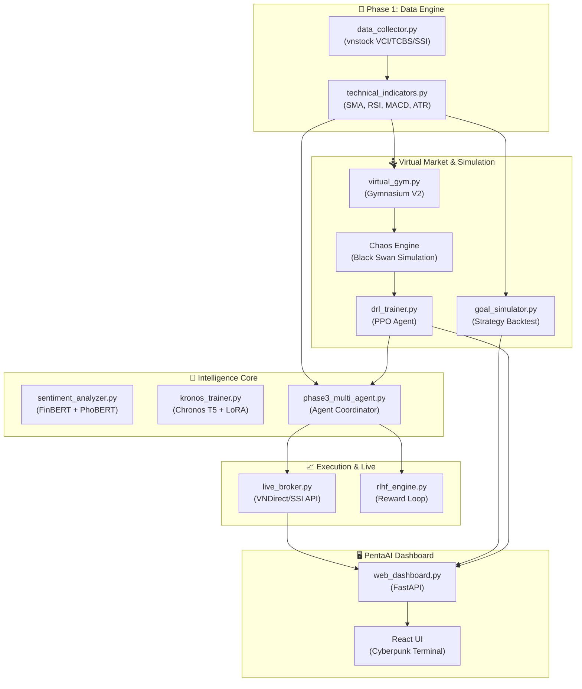

# PentaAna — Multi-Agent Stock Intelligence Framework

**PentaAna** (formerly KRONOS) is a high-performance, AI-native stock market analysis and autonomous trading framework specifically tailored for the Vietnamese market (VN-INDEX).

It orchestrates a sophisticated ensemble of **Chronos-based time-series forecasting**, **Multi-Agent coordination**, and **Deep Reinforcement Learning (DRL)** within a self-evolving MLOps pipeline.

---

## 🌟 New Feature: Strategy Intelligence & Simulation (V2)

The latest version introduces the **Goal-Oriented Investment Engine**, bridging the gap between raw AI signals and real-world capital management.

### 🎯 Goal-Oriented Simulation (Fast-Mode)
*   **Targeted Investment**: Set an initial capital (e.g., 9M VND) and a profit goal.
*   **Deterministic Logic**: Uses high-speed indicator-based strategy simulation without LLM overhead.
*   **Realistic Constraints**: Implements HOSE/HNX **lot sizing (100 shares)** and transaction fee modeling (0.2%).
*   **Safety First**: Full-cycle simulation including **Drawdown Monitoring** to expose risk post-target achievement.

### 🏛️ Virtual Strategy Gym (DRL V2)
*   **Deep Reinforcement Learning**: Powered by **OpenAI Stable-Baselines3 (PPO)**.
*   **Chaos Engine**: Simulates "Black Swan" events (Pandemic, Crisis) using a **Causal Sentiment → Price** model.
*   **No-Leak Architecture**: Recalculates all technical indicators (MACD, RSI) on the mutated "chaos" price to ensure zero future-leakage during training.
*   **Continuous Portfolio Control**: Agent learns optimal **Target Weighting [0-1]** instead of binary Buy/Sell, mastering the art of position sizing.

---

## 📊 System Overview

### Core Innovation
PentaAna implements a **4-Phase closed-loop system** where market intelligence continuously improves through feedback:

1.  **Phase 1: Data Precision** — Parquet-based market data warehousing + Technical Indicator compute.
2.  **Phase 2: Forecasting Brain** — Fine-tuned **Chronos T5** (via PEFT LoRA) for price trajectory.
3.  **Phase 3: Agent Orchestration** — Multi-Agent coordination (Tech, Sentiment, Macro, Risk).
4.  **Phase 4: Evolution & Execution** — RLHF-based weight adaptation + **Real-time Live Broker** integration.

---

## 🏗️ Architecture Diagram



---

## 🛠️ Technology Stack

### AI & Machine Learning
| Component | Technology | Significance |
|-----------|-----------|--------------|
| **DRL Algorithm** | **PPO (Proximal Policy Optimization)** | State-of-the-art stability in continuous action spaces |
| **RL Environment** | **Gymnasium (V2)** | Standardized env for agent-market interaction |
| **Forecasting** | **Chronos T5-Small** | Amazon's foundational time-series model |
| **Fine-Tuning** | **PEFT LoRA** | Drastically reduced VRAM footprint for M1/M2/M3 chips |

### Infrastructure & Execution
| Component | Technology | Significance |
|-----------|-----------|--------------|
| **Live Broker** | **VNDirect / SSI API** | Direct order execution on Vietnamese exchanges |
| **Async Backend** | **FastAPI + Uvicorn** | High-concurrency async pipeline support |
| **Data Format** | **Apache Parquet** | High-speed columnar data storage |
| **UI** | **React 18 + Recharts** | Real-time monitoring of Equity Curves & Drawdowns |

---

## 🚀 Getting Started

### 1. Requirements
*   Python 3.10+
*   Node.js 18+
*   `stable-baselines3`, `gymnasium`, `pyarrow` (New dependencies)

### 2. Setup
```bash
# Install dependencies
pip install -r requirements.txt
pip install stable-baselines3 gymnasium pyarrow

# Launch Backend
uvicorn src.web_dashboard:app --host 0.0.0.0 --port 8088

# Launch UI
cd dashboard && npm run dev
```

---

## 📖 Key Workflows

### Virtual Strategy Training (AI Gym)
1. Open Dashboard → **AI GYM** tab.
2. Observe the AI training in a 2024 "market episode".
3. The Chaos Engine will randomly inject sentiment shocks (Downturns).
4. Watch the AI learn to reduce its **Target Weight** before the price decay sets in.

### Goal-Oriented Backtesting
1. Navigate to **STRATEGY SIMULATION**.
2. Enter your initial capital (VND) and target profit goals.
3. The system runs a 1-year historical playback using the **Fast-Mode** policy.
4. Review the **Drawdown Chart** to understand the psychological risk of the strategy.

---

## 📁 Project Structure (Upgraded)
```
stock-ai/
├── src/
│   ├── virtual_gym.py      # [NEW] Virtual environment for AI training
│   ├── drl_trainer.py      # [NEW] PPO training orchestration
│   ├── goal_simulator.py   # [NEW] Targeted strategy simulation
│   ├── live_broker.py      # [NEW] Direct exchange integration (VND/SSI)
│   ├── rlhf_engine.py      # Signal rating & weight adaptation
│   ├── kronos_trainer.py   # LoRA forecasting engine
│   └── ...
├── dashboard/              # React Frontend
└── data/                   # Parquet datasets & PPO model checkpoints
```

---

## 🤝 Contributing & License
**MIT License**. Proprietary algorithms for Chaos Engineering. 
Built with ❤️ for the Vietnamese Trading Community.

**PentaAna © 2026 — Evolving Market Intelligence.**
