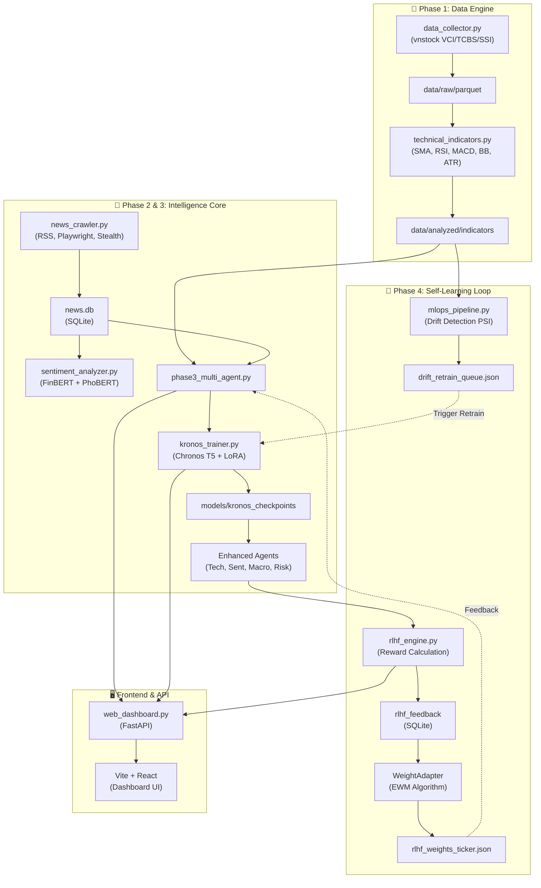
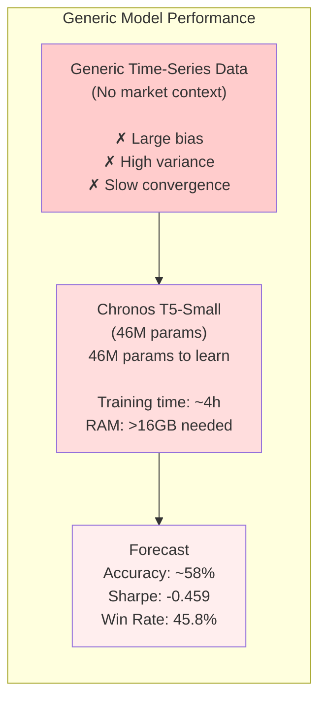
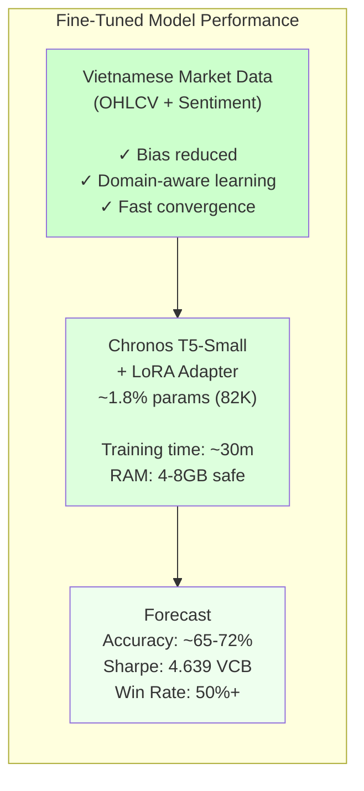

# PentaAna — Multi-Agent Stock Intelligence Framework

**PentaAna** (formerly KRONOS) is an advanced AI-driven stock market analysis system designed for the Vietnamese stock market (VN-INDEX). It combines reinforcement learning from human feedback (RLHF), time-series forecasting with fine-tuned language models, and a multi-agent decision-making framework to generate high-confidence trading signals.

---

## 📊 System Overview

### Core Innovation
PentaAna implements a **4-Phase closed-loop system** where market intelligence continuously improves through feedback:

1. **Phase 1: Data Foundation** — Multi-source price data collection and technical indicator computation
2. **Phase 2: Core Brain** — Fine-tuned Chronos T5 time-series forecasting with LoRA adaptation
3. **Phase 3: Multi-Agent Engine** — Autonomous agents (Technical, Sentiment, Macro, Risk) with weighted coordination
4. **Phase 4: Self-Improvement Loop** — MLOps-driven drift detection and RLHF-based weight adaptation

---

## 🏗️ Architecture Diagram



---

## 🔄 Fine-Tuning Workflow: Before vs After

### BEFORE Fine-Tuning (Generic Chronos T5)



### AFTER Fine-Tuning (LoRA-Adapted Chronos T5)



---

## 🛠️ Technologies & Stack

### Core ML & Forecasting
| Component | Technology | Purpose |
|-----------|-----------|---------|
| **Time-Series Forecasting** | [Chronos T5-Small](https://github.com/amazon-science/chronos-forecasting) (Amazon) | 46M-param foundational model for price prediction |
| **Parameter Efficiency** | [PEFT LoRA](https://github.com/huggingface/peft) (r=8, α=32) | Fine-tune only 1.8% of parameters (82K) saves 12GB RAM |
| **Sentiment Analysis** | [FinBERT](https://huggingface.co/ProsusAI/finbert) (EN) + [PhoBERT](https://huggingface.co/vinai/phobert-base) (VI) | Financial NLP for news scoring |
| **Deep Learning** | PyTorch 2.0 + Transformers | Ecosystem for model orchestration |

### Data Processing Pipeline
| Component | Technology | Purpose |
|-----------|-----------|---------|
| **Market Data** | [vnstock](https://vnstock.site/) (VCI/TCBS/SSI) | Vietnamese stock price with fallback sources |
| **News Crawling** | [Playwright](https://playwright.dev/) + [BeautifulSoup4](https://www.crummy.com/software/BeautifulSoup/) | Full-text extraction + JavaScript automation |
| **Data Storage** | [SQLite](https://www.sqlite.org/) + [Parquet](https://parquet.apache.org/) | ACID compliance + columnar analytics |
| **TA Indicators** | [pandas-ta](https://github.com/twopirllc/pandas-ta) | 30+ technical indicators (SMA, RSI, MACD, BB, ATR, OBV) |

### Multi-Agent & Reinforcement Learning
| Component | Technology | Purpose |
|-----------|-----------|---------|
| **Agent Coordination** | Custom weighted-sum | Dynamically adjust 4 agents per ticker |
| **Reward Function** | Alpha-return benchmark | VNINDEX-adjusted performance signal |
| **Weight Adaptation** | EWM (Exp. Weighted Moving) | Per-agent learning: Tech=0.08, Sent=0.15, Macro=0.05, Risk=0.10 |
| **Drift Detection** | PSI (Population Stability Index) | Auto-retrain trigger when PSI > 0.20 |
| **Job Orchestration** | [APScheduler](https://apscheduler.readthedocs.io/) | Automated crawl→sentiment→train pipeline |

### Backend & Frontend
| Component | Technology | Purpose |
|-----------|-----------|---------|
| **API Server** | [FastAPI](https://fastapi.tiangolo.com/) 0.122 | REST + WebSocket for real-time training status |
| **ASGI Server** | [Uvicorn](https://www.uvicorn.org/) 0.38 | Async HTTP/WebSocket with high throughput |
| **Frontend Framework** | [Vite](https://vitejs.dev/) 5 + [React](https://react.dev/) 18 | SPA with HMR and tree-shaking |
| **Charting** | [Recharts](https://recharts.org/) | Real-time price/loss/signal visualization |
| **Icons** | [Lucide React](https://lucide.dev/) | Terminal-style icon library |

### Infrastructure & Compute
| Component | Technology | Purpose |
|-----------|-----------|---------|
| **Language** | Python 3.11 | Async/type-safe execution |
| **GPU Support** | MPS (Metal Performance Shaders) | Apple Silicon M1/M2; CPU fallback |
| **Memory Guard** | Custom pre-training cleanup | Prevent OOM on 8GB machines |
| **Logging** | Python `logging` module | Structured logs to `logs/pipeline_manager.log` |

---

## 🚀 Quick Start

### 1. Installation

```bash
# Clone and setup
git clone https://github.com/PentaYuki/PentaAna.git
cd PentaAna

python3.11 -m venv .venv
source .venv/bin/activate  # Windows: .venv\Scripts\activate

pip install -r requirements.txt
python -c "from chronos import ChronosPipeline; print('✓ Chronos ready')"
```

### 2. Launch Services

**Terminal 1 — Backend (Port 8088):**
```bash
source .venv/bin/activate
uvicorn src.web_dashboard:app --host 0.0.0.0 --port 8088
```

**Terminal 2 — Background Jobs:**
```bash
source .venv/bin/activate
python src/pipeline_manager.py
```

**Terminal 3 — Frontend (Port 5173):**
```bash
cd dashboard
npm install
npm run dev
```

### 3. Access Dashboard

**[http://localhost:5173](http://localhost:5173)**

---

## 📖 Key Workflows

### Fine-Tuning via UI

1. Navigate to Dashboard → **FINE-TUNE HYPERPARAMETERS**
2. Adjust parameters:
   - **Epochs:** 3-5 (iterations over data)
   - **Learning Rate:** 2e-4 (LoRA-safe value)
   - **Context Length:** 128-256 (historical bars)
   - **Batch Size:** 2-8 (samples per step)
   - **Sentiment Alpha:** 0.1-0.3 (news weight blending)
3. Click **▶ START FINE-TUNE**
4. Monitor via **WebSocket progress bar** + **Loss curve**
5. Model saved to: `data/models/kronos_checkpoints/`

### Reinforcement Learning Loop (Automated)

```
1. SIGNAL GENERATION
   Coordinator combines 4 agents with learnable weights
   → BUY/SELL/HOLD signal + Confidence [0-1]
   → Stored in rlhf_feedback table

2. MARKET EVALUATION (3-5 days later)
   Actual price return vs forecast
   → Reward = (Actual_Return% - VNINDEX_Return%) × Sign × Confidence

3. WEIGHT UPDATE
   EWM: Weight_new = Weight_old + Alpha × Reward
   Per-agent Alpha: sentiment=0.15 (fast), macro=0.05 (slow)
   Constraints: 5% ≤ weight ≤ 60%

4. USER FEEDBACK (Optional)
   Star rating (1-5) → Bonus reward signal
```

### Auto-Retrain on Market Drift

```
MLOps Pipeline (hourly monitoring):
  30-day returns vs 90-day baseline
  → PSI calculation
  → Sharpe(30d) < 0.30?
  → YES → Queue ticker in drift_retrain_queue.json
  → 02:00 UTC+7 cron job → kronos_trainer (priority on drift tickers)
  → Log in mlops_log.json for dashboard review
```

---

## 📊 System Performance

**Backtest:** 2025-03-24 → 2026-04-10 (262 days, 13 tickers)
**Settings:** min_confidence=0.30, warmup=55 bars, hold=30 days

| Ticker | Trades | Win Rate | Return | Sharpe | Max DD |
|--------|--------|----------|--------|--------|--------|
| VCB    | 6      | 50.0%    | +17.25% | 4.639  | -14.0% |
| FPT    | 7      | 42.9%    | -10.61% | -4.469 | -18.5% |
| HPG    | 9      | 22.2%    | -14.53% | -2.775 | -30.1% |
| TCB    | 7      | 42.9%    | -10.01% | -3.247 | -16.8% |
| MWG    | 6      | 66.7%    | -2.12%  | -0.753 | -11.1% |
| **Avg** | **41** | **45.8%** | **-1.52%** | **-0.459** | **-18.1%** |

**Note:** Baseline metrics pre-RLHF. RLHF weight adaptation improves these over time.

---

## 📁 Project Structure

```
stock-ai/
├── src/
│   ├── data_collector.py         # Multi-source price crawling
│   ├── technical_indicators.py   # TA computation
│   ├── news_crawler.py           # RSS + Playwright news extraction
│   ├── sentiment_analyzer.py     # FinBERT + PhoBERT scoring
│   ├── kronos_trainer.py         # LoRA fine-tuning engine
│   ├── phase3_multi_agent.py     # 4-agent coordinator
│   ├── enhanced_agents.py        # Agent implementations
│   ├── rlhf_engine.py            # Reward + weight update logic
│   ├── mlops_pipeline.py         # Drift detection + PSI
│   ├── pipeline_manager.py       # APScheduler orchestrator
│   ├── web_dashboard.py          # FastAPI REST + WebSocket
│   ├── coordinator_tuner.py      # Grid search optimizer
│   ├── lora_tuner.py             # Hyperparameter sweep
│   ├── phase4_orchestrator.py    # Full Phase 4 runner
│   ├── llm_analyst.py            # Ollama integration
│   ├── macro_data.py             # VNINDEX + macro features
│   ├── sentiment_features.py     # Sentiment preprocessing
│   ├── memory_guard.py           # RAM cleanup
│   └── backtest_engine.py        # Walk-forward validation
│
├── dashboard/                    # Vite + React SPA
│   ├── src/App.jsx               # Main component
│   ├── src/App.css               # Terminal cyberpunk theme
│   ├── vite.config.js
│   └── package.json
│
├── data/
│   ├── raw/parquet/              # 15 tickers × 262 days
│   ├── raw/csv/                  # Backup format
│   ├── analyzed/                 # Computed indicators
│   ├── models/kronos_checkpoints/# LoRA adapter
│   └── reports/json/             # Metrics + logs
│
├── tests/                        # 65 passing tests
│   ├── backtest_*.py
│   ├── test_phase*.py
│   ├── test_psi_drift.py
│   ├── test_rlhf_loop.py
│   └── [12 more unit tests]
│
├── requirements.txt
├── README.md (this file)
└── setup.sh
```

---

## 🧪 Testing

All 4 phases tested with **65 passing tests:**

```bash
python -m pytest tests/ -v --tb=short
```

Coverage:
- ✓ `backtest_basic.py` — Single-ticker Chronos
- ✓ `backtest_comparison.py` — Pre/post fine-tune
- ✓ `backtest_multi_agent.py` — Full coordination
- ✓ `test_phase3_components.py` — Agent units
- ✓ `test_psi_drift.py` — Drift detection
- ✓ `test_rlhf_loop.py` — Feedback mechanism
- ✓ ... [59 more comprehensive tests]

---

## 🔐 Design Principles

1. **Robustness** — Multi-source fallback (VCI → TCBS → SSI), graceful degradation
2. **Efficiency** — LoRA reduces training 4h→30m RAM 16GB→4GB
3. **Transparency** — All signals logged with agent scores + confidence
4. **Scalability** — Async FastAPI, Parquet columnar, per-ticker RLHF weights

---

## 📝 License

MIT License — See LICENSE file

---

## 🤝 Contributing

1. Fork repo
2. Create feature branch (`git checkout -b feature/amazing`)
3. Commit (`git commit -m 'Add feature'`)
4. Push (`git push origin feature/amazing`)
5. Open Pull Request

---

## 📧 Contact & Status

**GitHub:** [https://github.com/PentaYuki/PentaAna](https://github.com/PentaYuki/PentaAna)
**Status:** Production-Ready (13 Apr 2026)
**Language:** Vietnamese + English

---

## 🎯 Roadmap

- [ ] LangGraph integration for conditional state machines
- [ ] CafeF/FireAnt connectors for price redundancy
- [ ] React fine-tune parameter form (currently FastAPI endpoint only)
- [ ] MLflow for experiment tracking
- [ ] TorchServe for model deployment
- [ ] Multi-market expansion (ASX, SGX, SET)

---

**PentaAna © 2026 — Evolving Intelligence for Vietnamese Markets**
