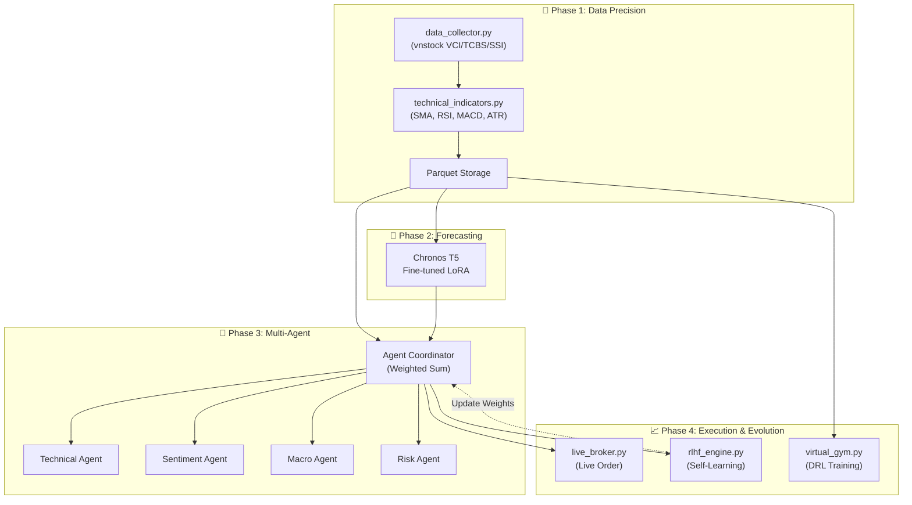
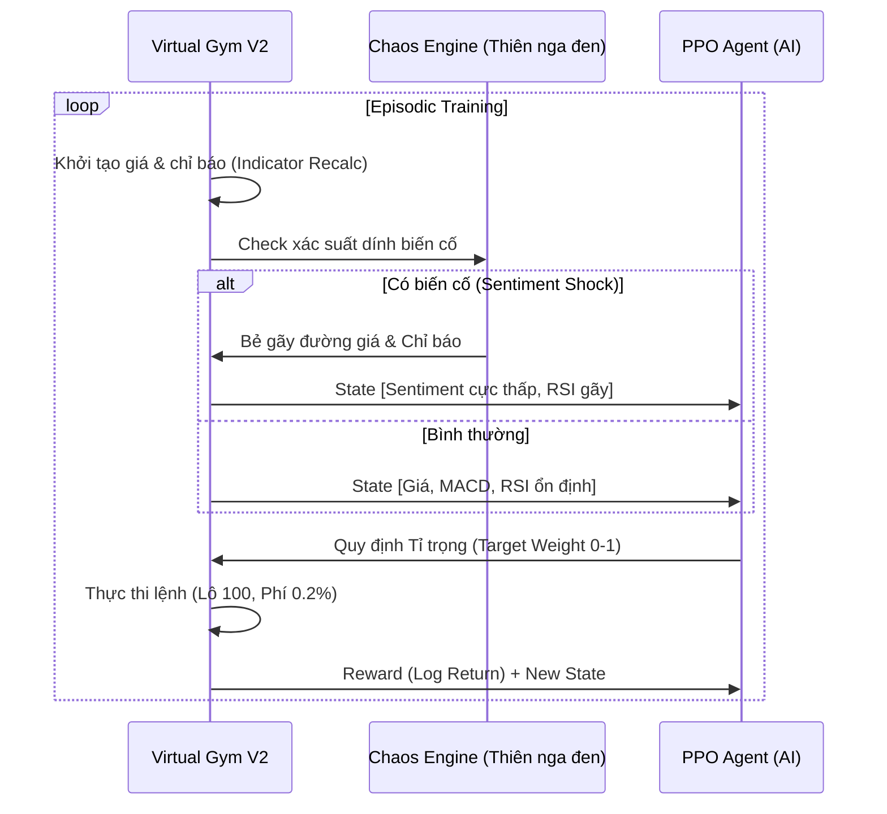
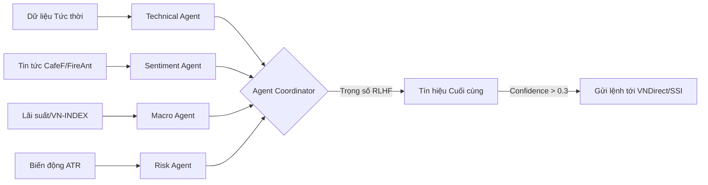
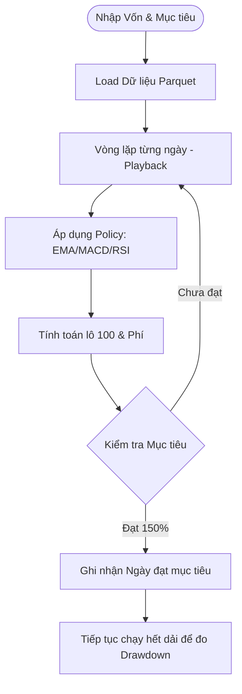

# 🚀 PentaAna: Multi-Agent Stock Intelligence & Autonomous Trading V2

**PentaAna** (formerly KRONOS) is a state-of-the-art AI ecosystem designed to dominate the Vietnamese stock market (VN-INDEX). It integrates **Generative AI forecasting**, **DRL-based strategy training**, and **Live Broker connectivity** into a single, cohesive MLOps-driven pipeline.

---

## 💎 Key Innovations in V2

### 1. Goal-Oriented Strategy Engine (`goal_simulator.py`)
Moving beyond simple signal generation, PentaAna V2 bản nâng cấp giới thiệu **Mô phỏng chiến lược mục tiêu**:
*   **Capital-Driven**: Đặt vốn ban đầu (VD: 6 triệu) và mục tiêu lãi (VD: 9 triệu).
*   **Professional Lot Sizing**: Hệ thống tự động tính khối lượng mua/bán theo **lô 100 cổ phiếu** (Chuẩn HOSE/HNX).
*   **Transaction Modeling**: Bao gồm phí giao dịch 0.2% và thuế 0.1% khi bán.
*   **Drawdown Guard**: Hiển thị biểu đồ **Drawdown (Sụt giảm tài sản)** để người dùng thấy rõ rủi ro sau khi đạt mục tiêu.

### 2. DRL Virtual Gym V2 (`virtual_gym.py` & `drl_trainer.py`)
Môi trường huấn luyện AI học cách chống chọi khủng hoảng:
*   **Chaos Engine (Black Swan Simulation)**: Giả lập các biến cố "Thiên nga đen" (Dịch bệnh, Khủng hoảng).
*   **Causal Logic**: Sốc tin tức (Sentiment) xảy ra **trước** khi giá sụp đổ, dạy AI phản xạ **phòng thủ từ xa**.
*   **No-Leak Indicators**: Các chỉ báo (MACD, RSI, EMA) được tính toán lại ngay trong môi trường Gym khi có biến động giá ảo, triệt tiêu lỗi "Rò rỉ tương lai".
*   **Continuous Control**: Sử dụng thuật toán **PPO (Proximal Policy Optimization)** để học **Target Weight [0.0 - 1.0]**.

---

## 🏗️ Kiến trúc Hệ thống (System Architecture)

### 1. Mô hình Tổng quát (High-Level Overview)
Dưới đây là sơ đồ luồng dữ liệu 4 giai đoạn từ lúc thu thập đến khi ra quyết định đầu tư:

### 2. Luồng Huấn luyện AI Gym (DRL Flow)
Chi tiết cách AI học tập trong môi trường giả lập có **Chaos Engine**:

### 3. Luồng Ra quyết định (Inference Flow)
Cách 4 Agent phối hợp để đưa ra tín hiệu MUA/BÁN thời gian thực:

### 4. Luồng Mô phỏng Mục tiêu (Simulation Flow)
Mô tả logic của bộ mô phỏng Fast-Mode:

---

## 🏗️ Detailed Phase Descriptions
Hệ thống thu thập dữ liệu đa nguồn (VCI, TCBS, SSI) để đảm bảo tính sẵn sàng. Dữ liệu được lưu trữ dưới dạng **Apache Parquet** để tối ưu tốc độ đọc ghi cho các thuật toán Deep Learning.

### Phase 2: Forecasting Brain (`src/kronos_trainer.py`)
Sử dụng mô hình gốc **Amazon Chronos T5**, kết hợp kỹ thuật **LoRA (Low-Rank Adaptation)**. 
*   **Target**: Dự báo quỹ đạo giá 5-10 phiên tiếp theo.
*   **Optimization**: Giảm 90% dung lượng VRAM, cho phép chạy trên MacBook Air (M1/M2).

### Phase 3: Multi-Agent Engine (`src/phase3_multi_agent.py`)
Hợp xướng bởi 4 Agent chuyên biệt:
1.  **Technical Agent**: Phân tích MACD, RSI, Bollinger Bands.
2.  **Sentiment Agent**: Quét tin tức CafeF, FireAnt, dùng PhoBERT để chấm điểm.
3.  **Macro Agent**: Phân tích mối tương quan VN-INDEX và lãi suất.
4.  **Risk Agent**: Sử dụng công nghệ **ATR (Average True Range)** để tính điểm dừng lỗ và kích thước vị thế.

### Phase 4: Evolution & RLHF (`src/rlhf_engine.py`)
Hệ thống tự học từ sai lầm:
*   **Auto-fill outcomes**: Tự động chấm điểm tín hiệu sau 5 ngày giao dịch.
*   **Weight Adaptation**: Tự động tăng trọng số cho Agent nào đang đoán đúng và giảm trọng số Agent đoán sai.

---

## 📊 Technical Deep Dive

### 1. Reward Logic (DRL)
Trong môi trường ảo, AI được thưởng dựa trên **Log Return** để khuyến khích sự tăng trưởng lũy kế:
$$Reward = \ln\left(\frac{NAV_t}{NAV_{t-1}}\right) \times 10$$

### 2. Risk Management (ATR Sizing)
Hệ thống tính số lượng cổ phiếu có thể mua dựa trên mức độ biến động (ATR):
$$Shares = \frac{Capital \times Risk\%}{ATR \times 1.5}$$

### 3. Chaos Engine Logic
Khi Thiên nga đen nổ ra, điểm Sentiment bị ép về giá trị cực âm:
$$Sentiment_{new} = \max(-0.95, Sentiment_{old} \times 0.3)$$
Sau đó 1-2 phiên, giá sẽ bắt đầu trượt dốc (Price Decay) từ 2-5% mỗi phiên.

---

## 🛠️ API & Endpoints Reference

| Phương thức | Endpoint | Chức năng |
| :--- | :--- | :--- |
| **POST** | `/api/simulate_strategy` | Chạy mô phỏng chiến lược Fast-Mode hướng mục tiêu. |
| **POST** | `/api/drl/start` | Bắt đầu huấn luyện AI cày cuốc trong môi trường ảo Gym V2. |
| **GET** | `/api/drl/status` | Lấy tiến độ và trạng thái học tập của AI. |
| **POST** | `/api/live/signal/{ticker}` | Chạy phân tích tín hiệu thời gian thực cho một mã. |
| **GET** | `/api/live/positions` | Danh sách các cổ phiếu AI đang nắm giữ thực tế. |

---

## 🚀 Troubleshooting & Hardware

### Hardware Recommendations
*   **M1/M2/M3 Mac**: Khuyến nghị dùng ít nhất 8GB Unified Memory.
*   **Linux/Windows**: Cần ít nhất 16GB RAM nếu chạy dự báo full-mode.

### Common Issues
*   **ImportError: Missing optional dependency 'pyarrow'**: Cần chạy `pip install pyarrow` để hỗ trợ lưu trữ Parquet.
*   **Ollama Connection Error**: Đảm bảo ứng dụng Ollama đang chạy ở background để xử lý phân tích ngôn ngữ tự nhiên.

---

## 📁 Key File Descriptions
*   `src/virtual_gym.py`: Môi trường giả lập ẢO cho AI rèn luyện.
*   `src/drl_trainer.py`: Cỗ máy huấn luyện PPO.
*   `src/goal_simulator.py`: Bộ mô phỏng chiến lược mục tiêu cho người dùng.
*   `src/live_broker.py`: Cầu nối giao dịch thực tới VNDirect/SSI.

---

## 📝 License
**MIT License.** PentaAna © 2026 — Trí tuệ tiến hóa cho thị trường chứng khoán Việt Nam.
